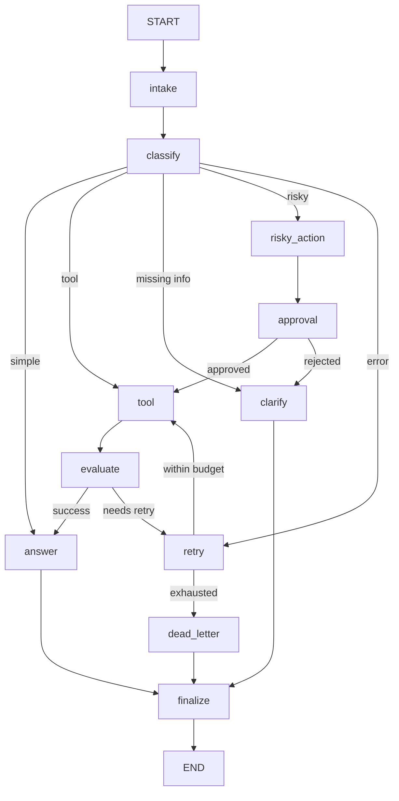

# LangGraph Agentic Orchestration Lab Report

## 1. Student

- Name: Nguyễn Đình Liên Thanh
- Repository: K4-Track3-Day23-2A202601790-NguyenDinhLienThanh
- Date: 2026-08-25

## 2. Architecture

The workflow uses a typed `AgentState` and eleven small nodes. Intake normalizes the
ticket, an LLM performs structured intent classification, and conditional edges select
simple answering, tool lookup, clarification, risky-action approval, or bounded retry.
All branches terminate through a shared finalize node. A checkpointer is compiled into
the graph and each scenario supplies an independent thread identifier.

Append-only reducers are used for messages, tool results, errors, and audit events.
Current route, retry count, evaluation result, approval, proposed action, pending question,
and final answer use overwrite semantics.

## 3. Metrics summary

| Metric | Value |
|---|---:|
| Total scenarios | 7 |
| Success rate | 100.0% |
| Average nodes visited | 6.43 |
| Total retries | 3 |
| Total interrupts/approvals | 2 |
| Total LLM calls | 12 |
| LLM judge calls | 0 |
| Structured fallbacks | 0 |
| Resume success | Yes |

## 4. Scenario results

| Scenario | Expected | Actual | Success | Retries | Approvals | LLM calls | LLM latency (ms) |
|---|---|---|---:|---:|---:|---:|---:|
| S01_simple | simple | simple | Yes | 0 | 0 | 2 | 12670 |
| S02_tool | tool | tool | Yes | 0 | 0 | 2 | 7343 |
| S03_missing | missing_info | missing_info | Yes | 0 | 0 | 1 | 4579 |
| S04_risky | risky | risky | Yes | 0 | 1 | 2 | 10524 |
| S05_error | error | error | Yes | 2 | 0 | 2 | 9814 |
| S06_delete | risky | risky | Yes | 0 | 1 | 2 | 7128 |
| S07_dead_letter | error | error | Yes | 1 | 0 | 1 | 3883 |

## 5. Failure analysis

1. **Transient tool failure:** tool results containing an explicit error marker are sent
   through evaluation and a bounded retry loop. Once `attempt >= max_attempts`, the request
   moves to dead letter instead of looping forever.
2. **Risky action without approval:** refund, deletion, cancellation, and outbound-message
   requests are classified as risky and must pass through the approval node. Rejected actions
   are redirected to clarification and never reach the tool.
3. **LLM judge unavailable:** explicit tool status is resolved before invoking the judge.
   Ambiguous results use the judge and fail safely to retry if that optional call is unavailable.

## 6. Persistence and recovery

The graph supports both in-memory checkpoints and SQLite WAL persistence. SQLite stores
durable state keyed by `thread_id`, enabling state-history inspection and later resume.

## 7. Extension work

- SQLite checkpointer with WAL mode.
- Optional real human-in-the-loop interruption via `LANGGRAPH_INTERRUPT=true`.
- LLM-as-judge evaluation with deterministic fallback.
- Selective retry for transient LLM errors and structured-output compatibility fallback.
- Versioned prompts and LLM-call/fallback metrics.
- Streamlit dashboard with live HITL resume, node trace, state inspection, checkpoint
  history, scenario-suite execution, and downloadable artifacts.

In the recorded before/after benchmark, heuristic-first evaluation reduced summed LLM
latency from 71,073 ms to 55,941 ms (21.3%) while preserving 100% scenario success.

## 8. Improvement plan

For production, replace mock tools with typed integrations, enforce authorization before
side effects, add idempotency keys, redact sensitive event data, capture provider token/cost
metadata, and evaluate classification against a larger adversarial dataset.
